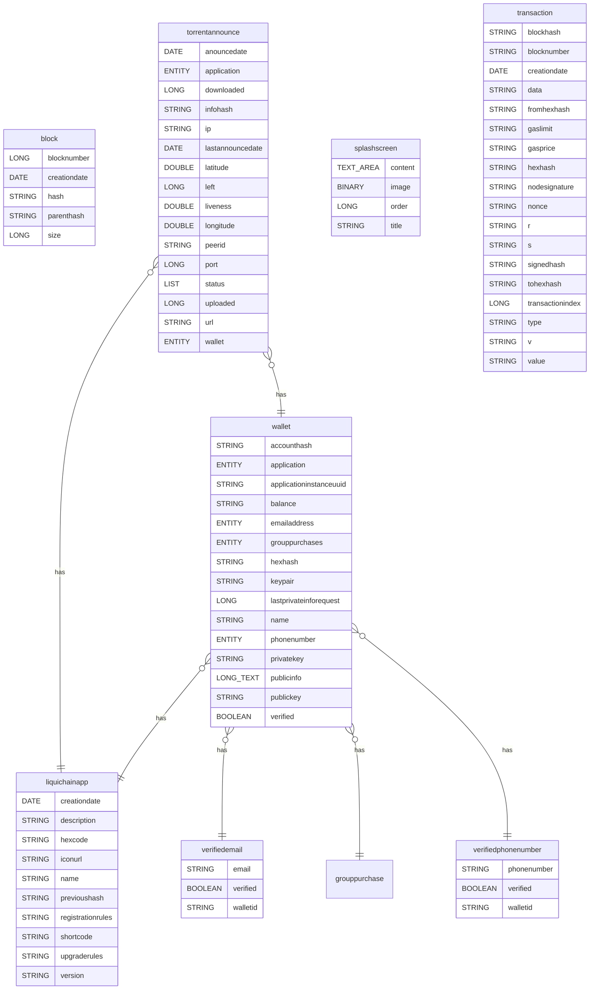

mv-docgen
=========
doc generator module - install this module and generate/update documentation (README.md) of any installed module by passing module code in postman endpoint call

Rest Service
------------
| Name         | Endpoint URL                      | Method | Description                                               |
| ------------ | --------------------------------- | ------ | --------------------------------------------------------- |
| docGenerator | /rest/module/{moduleCode}/doc/gen | POST   | Doc Generator Endpoint - to generate module documentation |

* Input Fields:

| Object     | Type   | Default Value | List Options | Obs / Conditions |
| ---------- | ------ | ------------- | ------------ | ---------------- |
| moduleCode | String |               |              |                  |

* Output Fields:

| Object | Type   | Description |
| ------ | ------ | ----------- |
| result | Object |             |

### Meveo Function
| Type           | Name                       | Path                                                                                                                                                   | Description          |
| -------------- | -------------------------- | ------------------------------------------------------------------------------------------------------------------------------------------------------ | -------------------- |
| Meveo Function | org.meveo.doc.DocGenScript | [master/facets/java/org/meveo/doc/DocGenScript.java](https://github.com/telecelplay/mv-docgen/blob/master/facets/java/org/meveo/doc/DocGenScript.java) | Doc Generator Script |

Postman Tests 
--------------
| Path                                                                                                                                                                             |
| -------------------------------------------------------------------------------------------------------------------------------------------------------------------------------- |
| [master/facets/postman/Doc_Generator_API.postman_collection.json](https://github.com/telecelplay/mv-docgen/blob/master/facets/postman/Doc_Generator_API.postman_collection.json) |


ERD Diagram GroupBuying
-----------


```mermaid
erDiagram
liquimartproductreview }o--|| wallet : buyerwalletaddress
liquimartproductreview {
ENTITY buyerwalletaddress PK
LONG_TEXT comments 
STRING productcode 
DATE purchasedate 
LONG rating 
STRING reviewdate
STRING sellerwalletaddress 
}
purchaseorder }o--|| wallet : customer
purchaseorder }o--|| grouppurchase : grouppurchase
purchaseorder ||--o{ purchaseorderline : orderlines
purchaseorder {
DOUBLE amount 
STRING cashbacktransactionid 
DATE creationdate 
ENTITY customer 
ENTITY grouppurchase 
STRING orderid false
CHILD_ENTITY orderlines 
STRING paymenttransaction 
STRING productid 
STRING purchasetransactionid 
LONG quantity 
}
grouppurchase }o--|| wallet : ackmembers
grouppurchase }o--|| wallet : creator
grouppurchase }o--|| purchaseorder : memberpurchases
grouppurchase }o--|| wallet : members
grouppurchase }o--|| wallet : paidmembers
grouppurchase {
ENTITY ackmembers false
STRING cashbacktransactions false
DATE creationdate false
ENTITY creator false
LONG currentmemberscount false
STRING discountid false
LONG discountminparticipants false
DOUBLE discountpercent false
DATE expirydate false
DATE lastupdate false
ENTITY memberpurchases false
ENTITY members false
STRING name false
ENTITY paidmembers false
LONG paidmemberscount false
STRING productid false
STRING productname false
LONG purchasedquantity false
LIST status false
}
cart }o--|| wallet : customer
cart }o--|| grouppurchase : grouppurchase
cart ||--o{ purchaseorderline : orderlines
cart {
DOUBLE amount false
DATE creationdate false
ENTITY customer false
ENTITY grouppurchase false
CHILD_ENTITY orderlines false
}
product }o--|| merchant : merchant
product {
LONG bestseller false
LONG categid false
STRING code false
LONG costcurrencyid false
DATE createdate false
LONG currencyid false
STRING displayname false
LONG groupdiscountid false
LONG id false
DOUBLE listprice false
LONG locationid false
ENTITY merchant false
STRING name false
}
merchant }o--|| wallet : wallet
merchant {
SECRET accountcountercode false
STRING accountfirstname false
STRING accountlastname false
SECRET accountribkey false
STRING bankaccountnumber false
STRING bankcode false
SECRET cardcvc false
STRING cardexpirymonth false
STRING cardexpiryyear false
STRING cardholderfirstname false
STRING cardholderlastname false
SECRET cardnumber false
STRING cardtype false
LONG id false
STRING name false
STRING orangephonenumber false
ENTITY wallet false
}
purchaseorderline {
STRING currency false
DOUBLE price false
STRING productid false
STRING productimageid false
STRING productname false
LONG quantity false
DOUBLE unitprice false
}
```

ERD Diagram Liquichain
-----------


