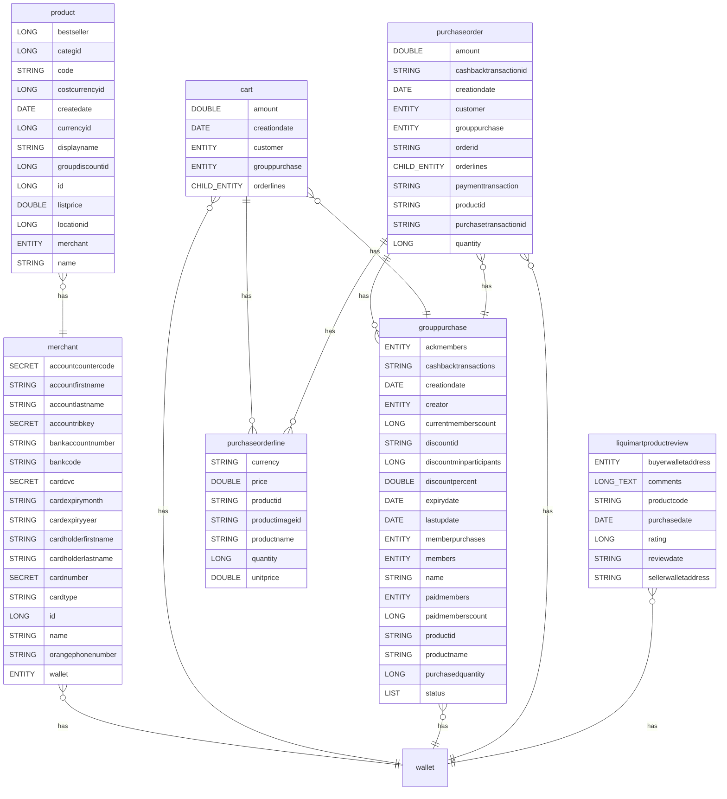
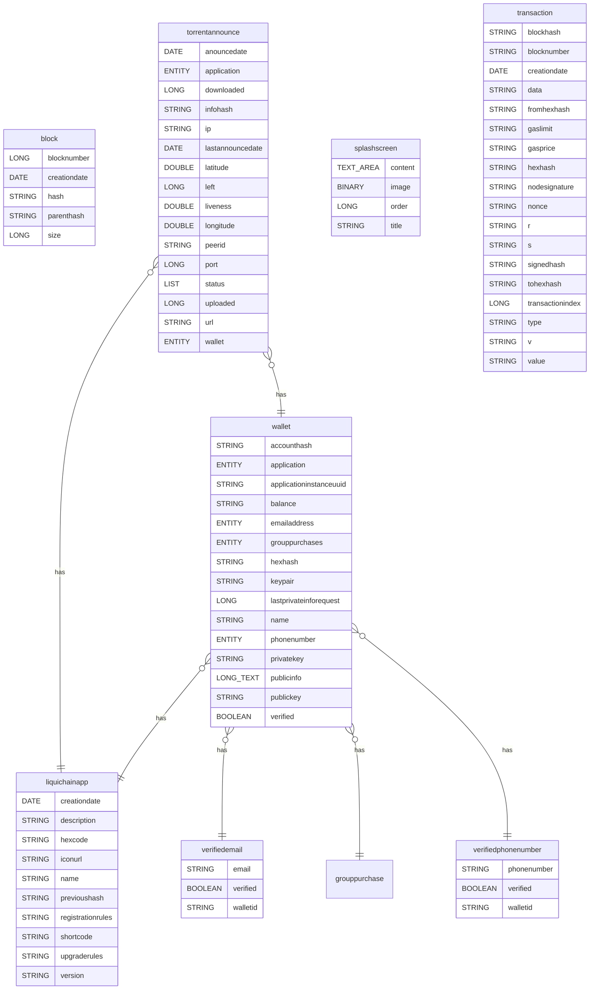

mv-docgen
=========
doc generator module - install this module and generate/update documentation (README.md) of any installed module by passing module code in postman endpoint call

Rest Service
------------
| Name         | Endpoint URL                      | Method | Description                                               |
| ------------ | --------------------------------- | ------ | --------------------------------------------------------- |
| docGenerator | /rest/module/{moduleCode}/doc/gen | POST   | Doc Generator Endpoint - to generate module documentation |

* Input Fields:

| Object     | Type   | Default Value | List Options | Obs / Conditions |
| ---------- | ------ | ------------- | ------------ | ---------------- |
| moduleCode | String |               |              |                  |

* Output Fields:

| Object | Type   | Description |
| ------ | ------ | ----------- |
| result | Object |             |

### Meveo Function
| Type           | Name                       | Path                                                                                                                                                   | Description          |
| -------------- | -------------------------- | ------------------------------------------------------------------------------------------------------------------------------------------------------ | -------------------- |
| Meveo Function | org.meveo.doc.DocGenScript | [master/facets/java/org/meveo/doc/DocGenScript.java](https://github.com/telecelplay/mv-docgen/blob/master/facets/java/org/meveo/doc/DocGenScript.java) | Doc Generator Script |

Postman Tests 
--------------
| Path                                                                                                                                                                             |
| -------------------------------------------------------------------------------------------------------------------------------------------------------------------------------- |
| [master/facets/postman/Doc_Generator_API.postman_collection.json](https://github.com/telecelplay/mv-docgen/blob/master/facets/postman/Doc_Generator_API.postman_collection.json) |

ERD Diagram GroupBuying
-----------

ERD Diagram Liquichain
-----------

